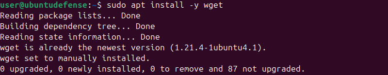
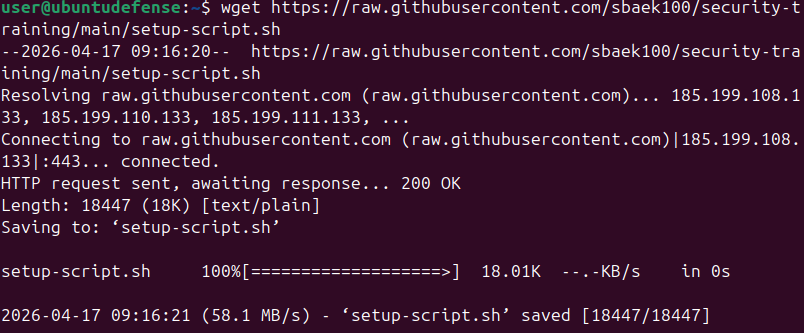
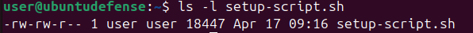
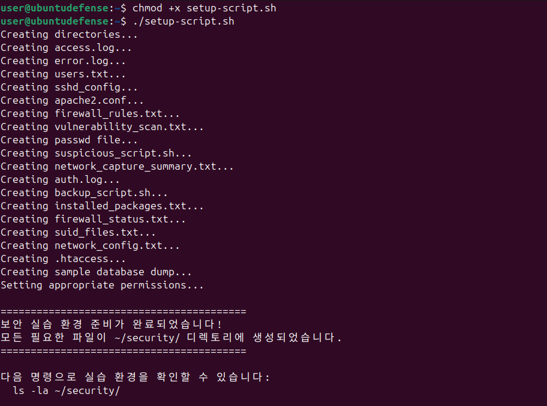
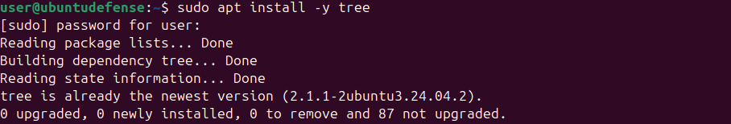
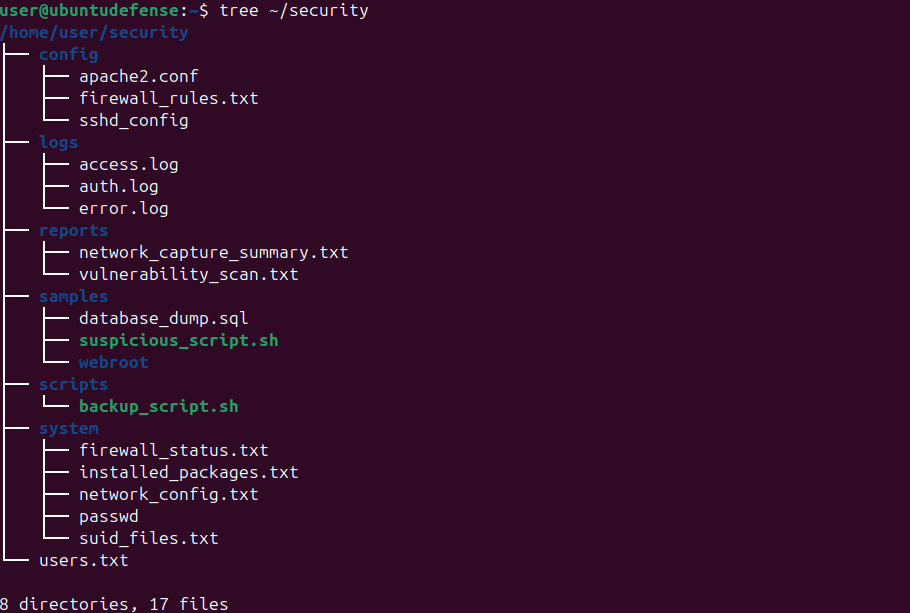
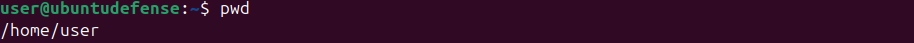
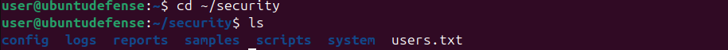

## 🔧 사전 설치

**1. Wpeg(WP Easy Generator)설치**

**2. 실습 script 설치**

**3. script 권한 확인 및 실행 권한 부여** 

**4. tree 설치 후 실습파일 구조 확인**

## 📝 실습 문제 풀이 

**1.문제: 현재 경로를 확인**

**2.문제: Security 디렉토리로 이동 후 폴더,파일 확인**

