# 🔧 사전 설치

**1. Wpeg(WP Easy Generator)설치**

**2. 실습 script 설치**

**3. script 권한 확인 및 실행 권한 부여** 

**4. tree 설치 후 실습파일 구조 확인**

# 📝 실습 문제 풀이 

**1. 문제: 현재 경로를 확인**

**2. 문제: Security 디렉토리로 이동 후 폴더,파일 확인**

**3. 문제: ~/security/samples 디텍터리에 숨긴파일을 확인**
 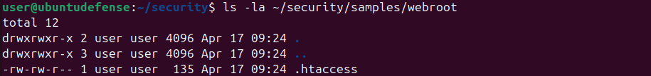

**4. 문제: sshd_config 파일 내용을 출력**

**5. 문제: suspicious_script.sh 파일의 권한과 소유자를 확인**
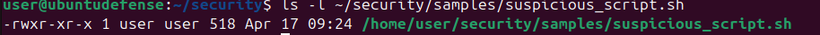

**6. 문제: suspicious_script.sh에 소유자 실행 권한을 제거 및 추가** 
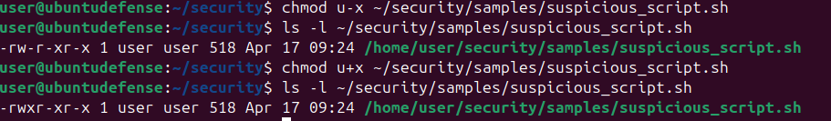

**7. 문제: auth.log에서 Failed가 포함된 줄을 모두 찾기**
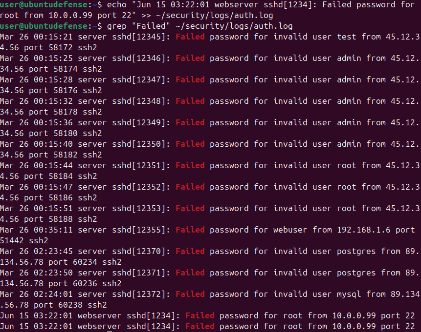

**8. 문제: auth.log에서 Failed가 포함된 줄이 총 개수 출력** 

**9. 문제: access.log에 HTTP 상태 코드 404가 포함된 줄 총 개수 출력**.

**10. 문제: access.log의 IP 주소(첫 번째 열)만 출력**
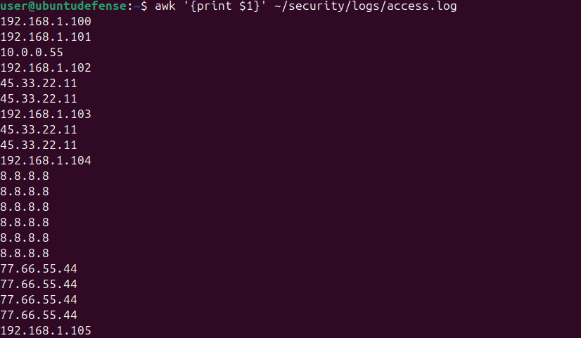

**11. 문제: IP별 접속 횟수를 구하고 많은 순서대로 출력**
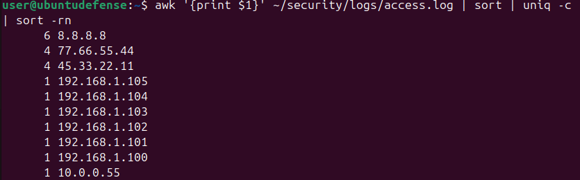

**12. 문제: 로그인 실패 줄에서 IP 주소만 출력**

**13. 문제: passwd에서 사용자 이름만 출력**
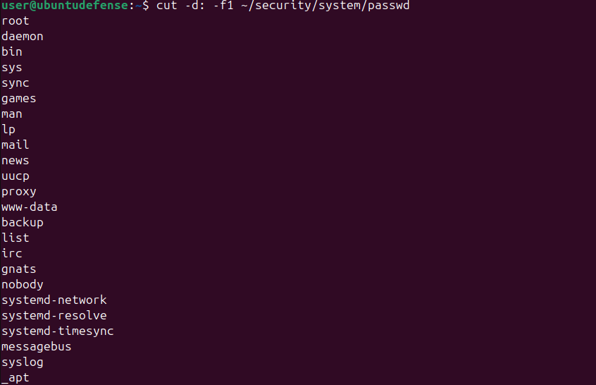

**14. 문제: .log 확장자를 가진 파일을 재귀적으로 검색**

**15. 문제: 각 하위 디렉터리의 디스크 사용량을 확인**
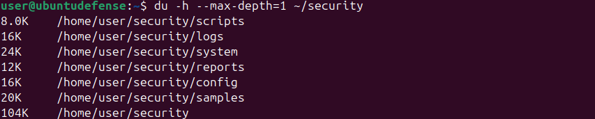

**16. 문제: logs 디렉터리를 tar.gz로 압축**
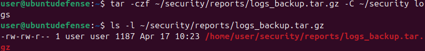

**17. 문제: access.log에서 404 상태코드 포함 줄 ~/security/reports/404_report.txt로 저장**
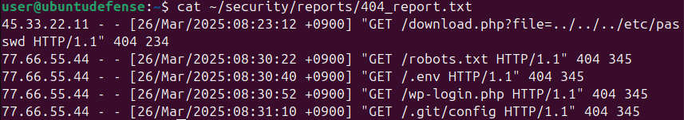

**18. 문제: 변수와 echo를 사용하는 Bash 스크립트를 작성하고 실행**
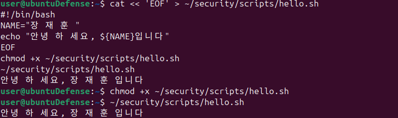

**19. 문제: if 조건문과 -f 테스트를 사용하는 스크립트를 작성하고 실행**
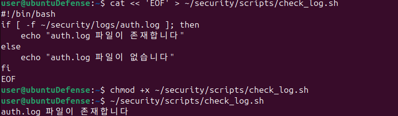

**20. 문제: for 반복문, grep -ic, 변수를 사용하는 스크립트를 작성하고 실행**
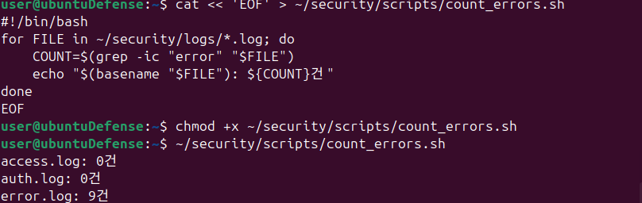