# 🔧 실습 준비

---

**1. 데이터베이스 생성 및 데이터베이스 지정**

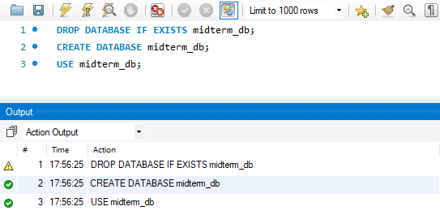

**2. 학과 테이블 생성**

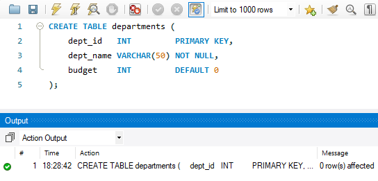

**3. 학생 테이블 생성**


**4. 데이터 입력**

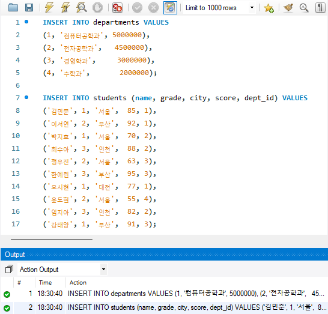

**5. 입력 확인**

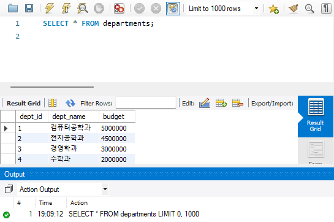
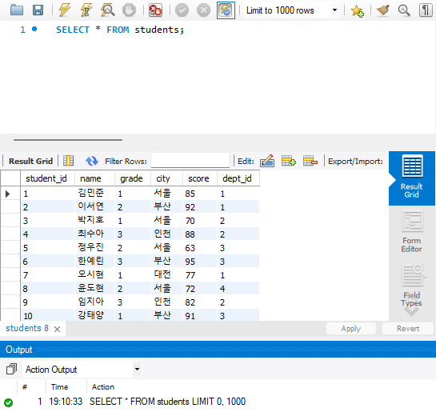

---

# 📝 실습 문제 풀이 

**1. 문제: students 테이블의 모든 컬럼과 모든 행을 조회**


**2. 문제: students 테이블에서 name과 score 컬럼만 조회**
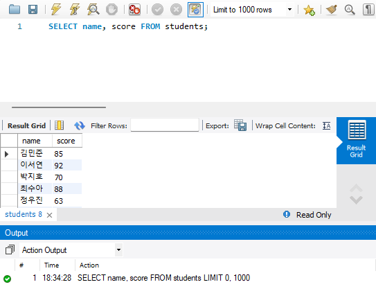

**3. 문제: students 테이블에서 grade가 1인 학생만 조회**
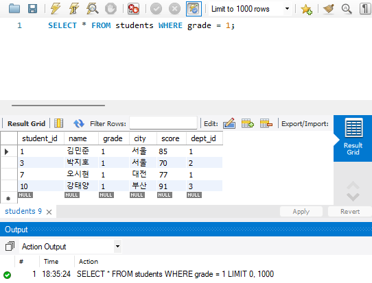

**4. 문제: students 테이블에서 score가 80 이상인 학생의 이름과 점수를 조회**
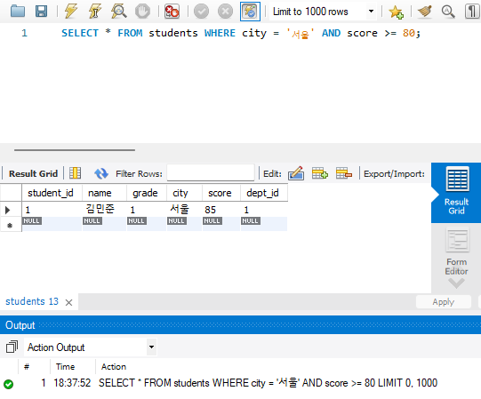

**5. 문제: students 테이블에서 city가 '서울'이고 score가 80 이상인 학생을 조회**


**6. 문제: students 테이블에서 city가 '부산'이거나 '인천'인 학생을 조회**
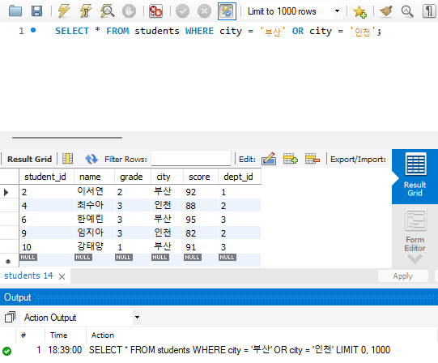
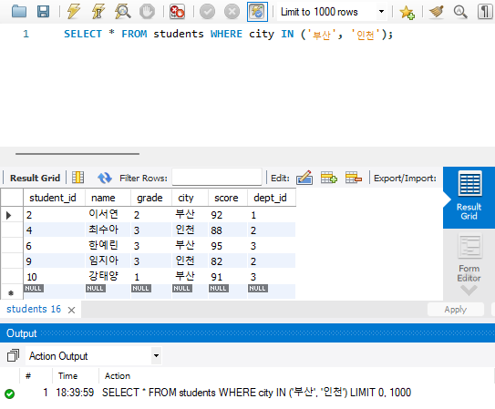

**7. 문제: students 테이블에서 이름이 '김'으로 시작하는 학생을 조회**
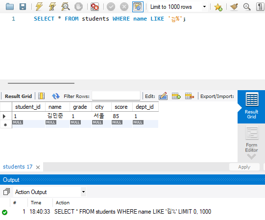

**8. 문제: students 테이블에서 score가 70 이상 90 이하인 학생을 조회**
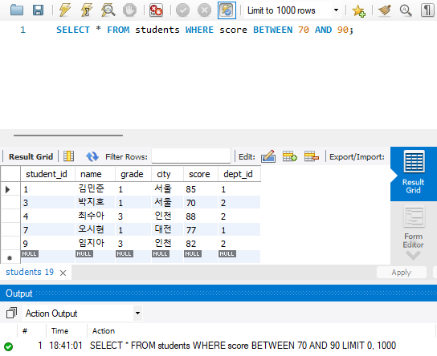

**9. 문제: students 테이블의 전체 행을 score 기준 내림차순으로 정렬해서 조회**
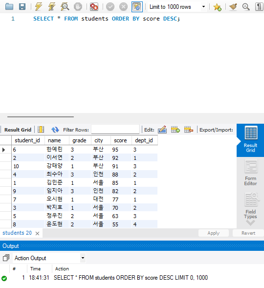

**10. 문제: students 테이블에서 grade를 기준으로 오름차순, 같은 학년이면 score 기준 내림차순으로 정렬**
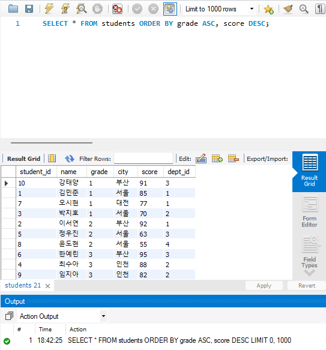

**11. 문제: students 테이블의 전체 학생 수를 구하라.**
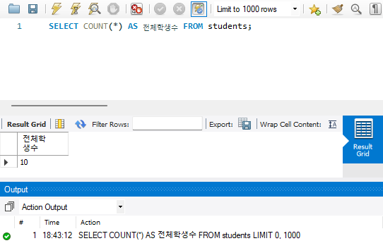

**12. 문제: students 테이블에서 score의 합계와 평균을 함께 조회**
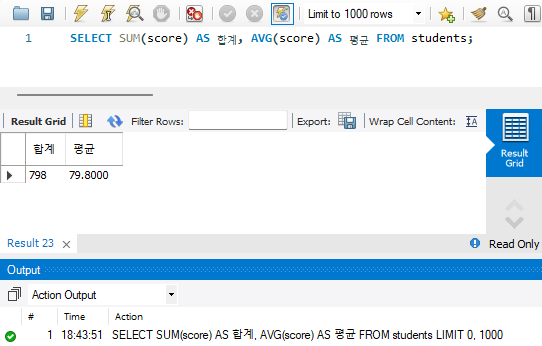

**13. 문제: students 테이블에서 score의 최댓값과 최솟값을 조회**
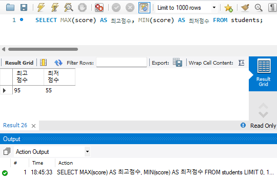

**14. 문제: students 테이블에서 grade(학년)별로 학생 수와 평균 점수를 구하라.**
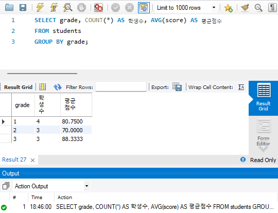

**15. 문제: students 테이블에서 dept_id별 평균 점수를 구하되, 평균이 80 이상인 학과만 출력**
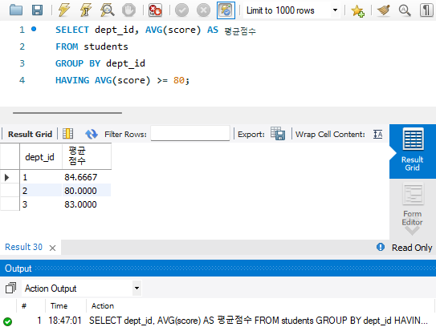

**16. 문제: students 테이블에서 city별 학생 수를 구하고, 학생 수가 많은 순서대로 정렬**
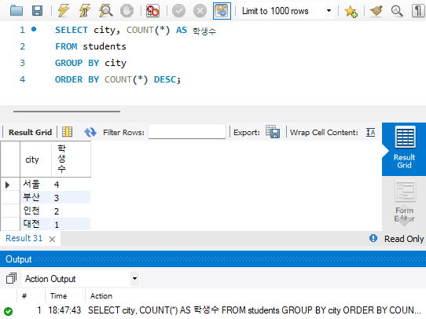

**17. 문제: students 테이블에서 윤도현의 score를 72로 변경하라. 변경 후 결과를 SELECT로 확인**
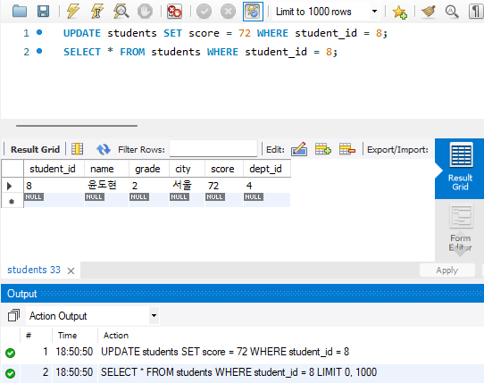

**18. 문제: students 테이블에서 score가 60 미만인 학생을 삭제하라. 삭제 전 SELECT로 대상을 먼저 확인**
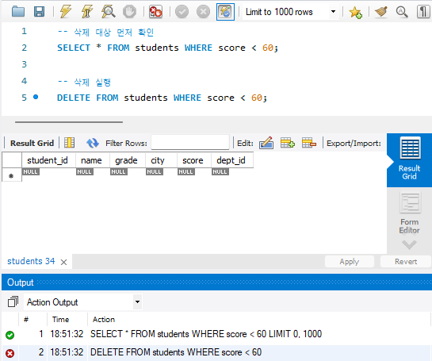

**19. 문제: 아래 조건으로 orders 테이블을 새로 만들고 확인.**

| 컬럼       | 자료형        | 제약조건                    |
| :--------- | :------------ | :-------------------------- |
| order_id   | INT           | PRIMARY KEY, AUTO_INCREMENT |
| item_name  | VARCHAR(100)  | NOT NULL                    |
| quantity   | INT           | NOT NULL, DEFAULT 1         |
| price      | DECIMAL(10,2) | NOT NULL                    |
| order_date | DATE          |                             |

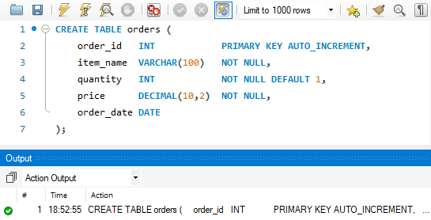
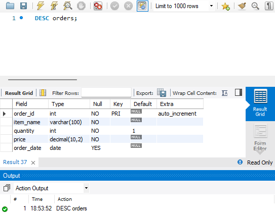

**20. 문제: students 테이블의 dept_id 컬럼이 departments 테이블의 dept_id를 참조하도록 외래 키(FOREIGN KEY)를 추가하라.**

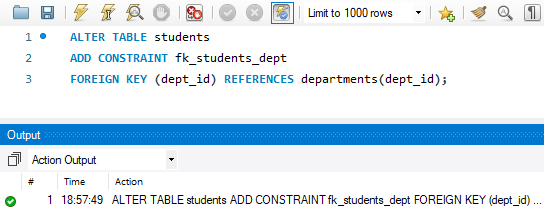
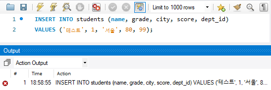

# 📝 주관식 문제

**1. 문제: SQL 명령어는 기능에 따라 DDL, DML, DCL로 분류된다. CREATE, SELECT, DROP, ALTER를 각각 해당 분류에 넣으시오.**

답: 

**2. PRIMARY KEY의 특성 두 가지를 쓰시오.**
답:

**3. 아래 SQL에서 빈칸에 들어갈 키워드를 쓰시오.**
답:

**4. 트랜잭션의 ACID 특성 4가지를 쓰고, 각각을 한 문장으로 설명하시오.**
답:

**5. 아래 SQL의 실행 결과로 COUNT(*)와 COUNT(score)에서 각각 어떤 값이 출력되는지 쓰고, 두 결과가 다른 이유를 설명하시오.**
```sql
-- score 컬럼 값: 85, NULL, 90, NULL, 75
SELECT COUNT(*), COUNT(score) FROM test_table;
```
답:

**6. FOREIGN KEY 제약조건의 역할을 설명하고, FOREIGN KEY 컬럼에 NULL이 허용되는지 여부와 그 이유를 쓰시오.**
답:

**7. 아래 SQL이 내부적으로 처리되는 실행 순서(FROM, WHERE, GROUP BY, HAVING, SELECT, ORDER BY)를 올바르게 나열하시오.**
```sql
SELECT dept_id, AVG(score)
FROM students
WHERE grade >= 2
GROUP BY dept_id
HAVING AVG(score) > 80
ORDER BY AVG(score) DESC;
```
답:

**8. 아래 설명이 가리키는 데이터베이스 용어를 쓰시오.**
> 릴레이션에서 튜플을 유일하게 식별할 수 있는 속성들의 집합으로, 유일성과 최소성을 모두 만족해야 한다.
답:

**9. WHERE와 HAVING의 차이점을 GROUP BY 실행 순서와 연관지어 설명하시오.**
답:

**10. GROUP BY 절을 사용할 때 SELECT 절에 올 수 있는 항목과 올 수 없는 항목을 구분하여 설명하시오.**
답: